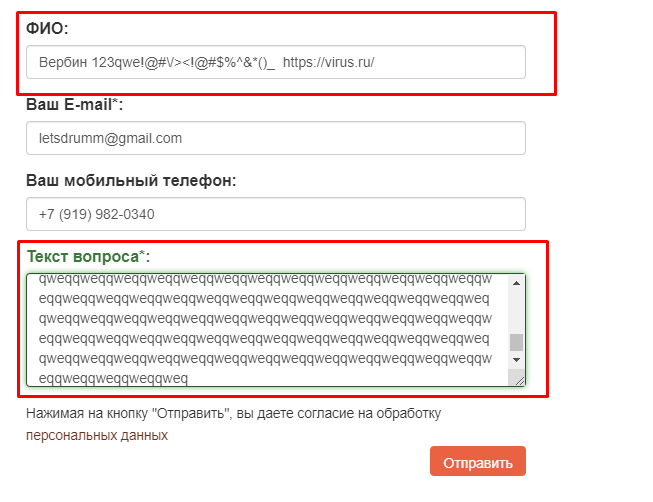
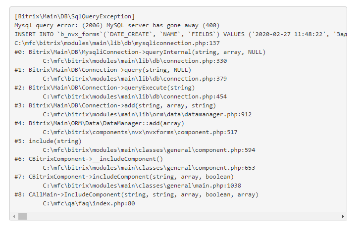
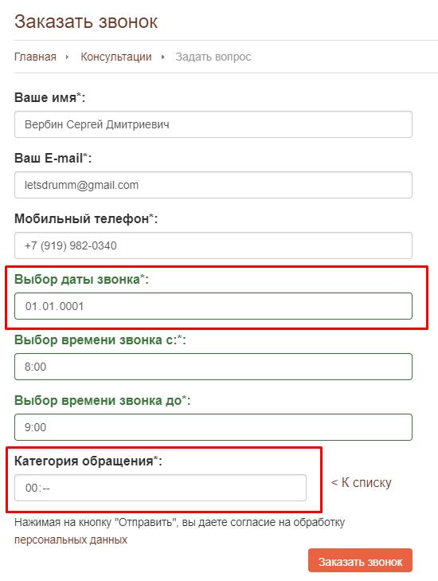
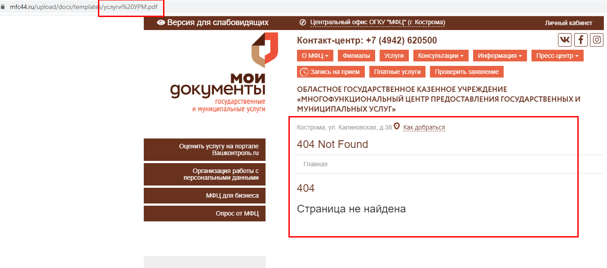
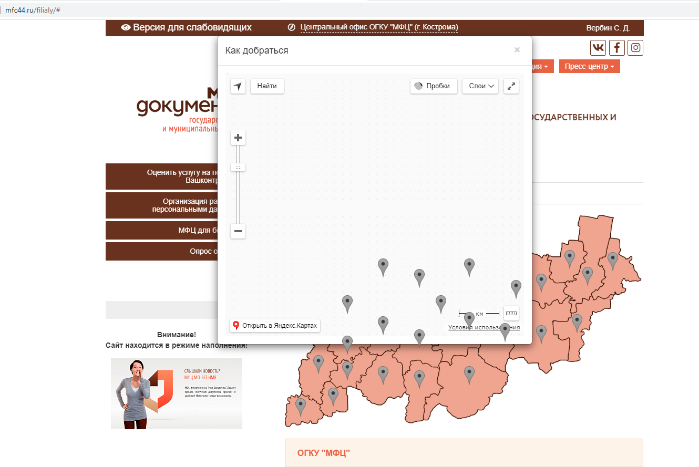
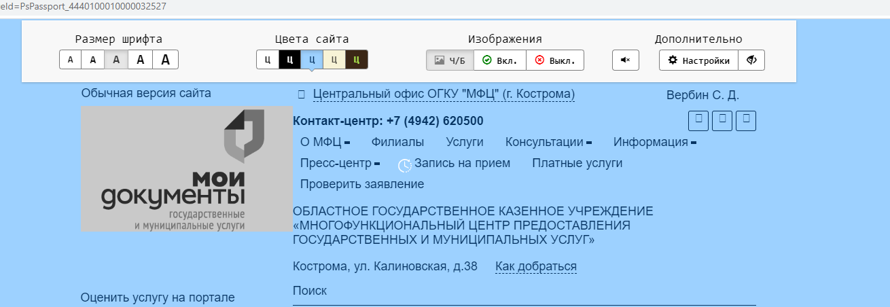

# MFC

## Форма: Задать вопрос

1. Авторизоваться (ЕСИА)
2. Нажать ```Консультации```
3. Нажать ```Задать вопрос```
4. Первые три поля автозаполняются.

Отсутствует валидация на поля: 
- ФИО;
- Текст вопроса.



При вводе в поле ```Текст обращения``` огромного количества символов, сервис начинает зависать, после отправки обращения выдает следующее



## Форма: Заказать звонок

1. Авторизоваться (ЕСИА)
2. Нажать ```Консультации```
3. Нажать ```Заказать звонок```
4. Первые три поля автозаполняются.

Отсутствует ограничение в поле ```Выбор даты звонка```.
Также при выборе ```Другое (напишите свой вариант)``` в поле ```Категория обращения``` поле становится предназначенным для времени, а не для текста.



## Услуги

1. Авторизоваться (ЕСИА)
2. Нажать ```Услуги```
3. Выбрать любую услугу
4. В разделе ```Описание``` нажать ```Получить услугу```

Произойдет переход на ```https://44gosuslugi.ru/```, но не на услугу.

## О МФЦ

1. Авторизоваться (ЕСИА)
2. Нажать ```О МФЦ```
3. Нажать ```УРМ```
4. В самом конце страницы будет ссылка ```Перечень оказываемых услуг здесь!```

При переходе выдает следующее.



## Карта филиалов
1. Авторизоваться (ЕСИА)
2. Зайти в ```Филиалы```
3. Нажать ```Как добраться```

Отображается некорректно



## Мои документ (версия для слабовидящих)
1. Авторизоваться (ЕСИА)
2. Нажать слева вверху ```Версия для слабовидящих`
3. В категории ```Изображения``` нажать ```Ч/Б```
4. Выбрать цвет сайта отличный от черного

Логотип ```Мои документы```, иконки и карта отображается некорректно

