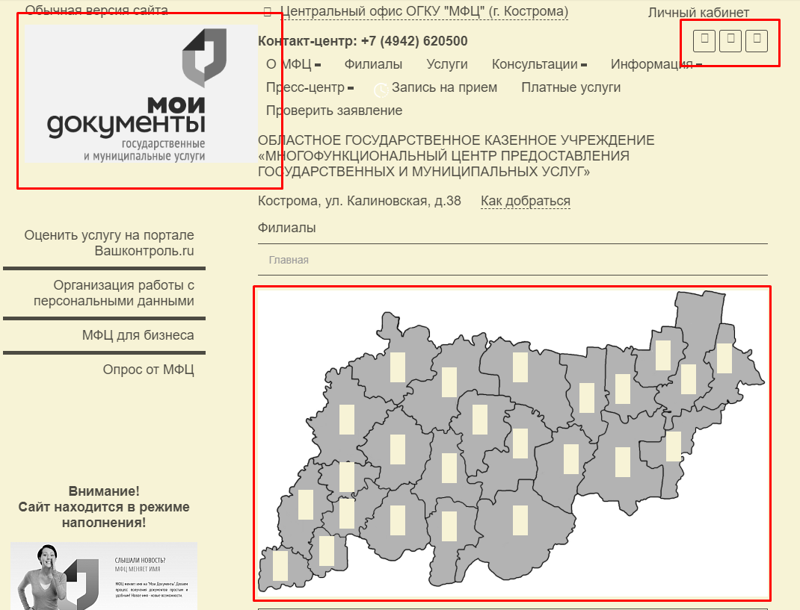

# MFC

## Форма: Задать вопрос
**https://rm.mfc.ru/issues/18939**

1. Авторизоваться (ЕСИА)
2. Нажать ```Консультации```
3. Нажать ```Задать вопрос```
4. Первые три поля автозаполняются.

Отсутствует валидация на поля: 
- ФИО;
- Текст вопроса.


При вводе в поле ```Текст обращения``` огромного количества символов, сервис начинает зависать, после отправки обращения выдает следующее


## Форма: Заказать звонок
**https://rm.mfc.ru/issues/18940**

1. Авторизоваться (ЕСИА)
2. Нажать ```Консультации```
3. Нажать ```Заказать звонок```
4. Первые три поля автозаполняются.

Отсутствует ограничение в поле ```Выбор даты звонка```.
Также при выборе ```Другое (напишите свой вариант)``` в поле ```Категория обращения``` поле становится предназначенным для времени, а не для текста.


## Очередь
**https://rm.mfc.ru/issues/18988**

1. Авторизоваться (ЕСИА)
2. Перейти сюда ```https://mfc44.ru/ochered.php```
3. Ожидать ответ

Если запрос выполняется более 2 минут, то будет получен 500 стасус код и появится следующее:


Если запрос выполняется менее двух минут, то появится следующее:


## Онлайн-консультация
**https://rm.mfc.ru/issues/31054**

**Онлайн-косультант работает корректно**

Проверено: 
- Отправка сообщений
- Получение сообщений от консультанта
- Отправление смайликов (стикеров)
- Сворачивание чата
- Разворачивание чата с сохранением истории чата
- Сохранение истории чата в HTML

[Ссылка на историю чата в HTML](https://github.com/letsdrum/qa/blob/master/26.02.2020/2020-02-26T12_30_46.887Z_mfc44.ru_chat_log.html)


## Услуги
**https://rm.mfc.ru/issues/31055**

1. Авторизоваться (ЕСИА)
2. Нажать ```Услуги```
3. Выбрать любую услугу
4. В разделе ```Описание``` нажать ```Получить услугу```

Произойдет переход на ```https://44gosuslugi.ru/```, но не на услугу.

## О МФЦ

1. Авторизоваться (ЕСИА)
2. Нажать ```О МФЦ```
3. Нажать ```УРМ```
4. В самом конце страницы будет ссылка ```Перечень оказываемых услуг здесь!```

При переходе выдает следующее.


## Карта филиалов
1. Авторизоваться (ЕСИА)
2. Зайти в ```Филиалы```
3. Нажать ```Как добраться```

Отображается некорректно


## Мои документы (версия для слабовидящих)
1. Авторизоваться (ЕСИА)
2. Нажать слева вверху ```Версия для слабовидящих`
3. В категории ```Изображения``` нажать ```Ч/Б```
4. Выбрать цвет сайта отличный от черного

Логотип ```Мои документы```, иконки и карта отображается некорректно

